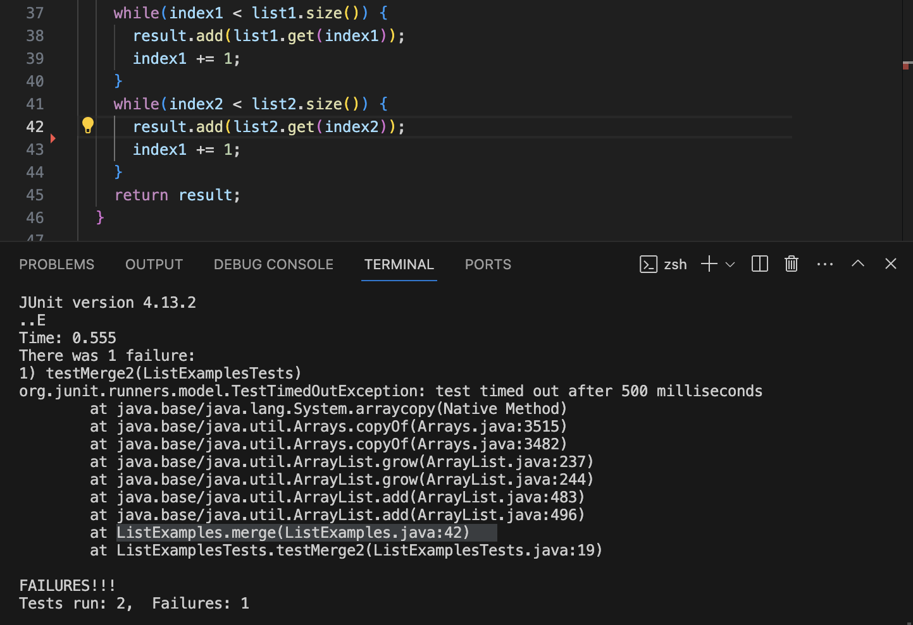
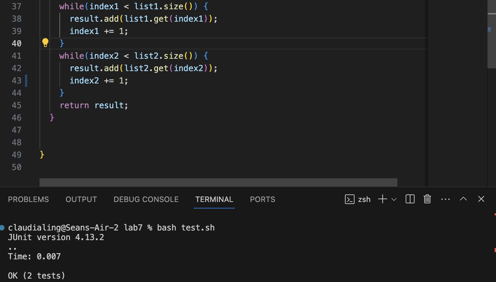

## Part 1
1. Content of student's post
 
- The symptom is that there is a syntax error in the code since the failure-inducing output shows that there is failures in such code where the error is on shown to be on a specifc line.

2. Response from TA
- Does the logic of the each line of the code make sense? Check syntax of each line of code that may be producing a failure.

3. Terminal Output
 
- The bug 
