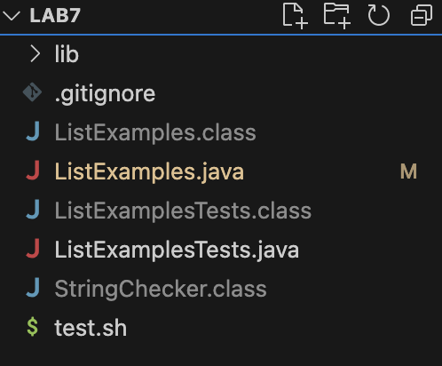
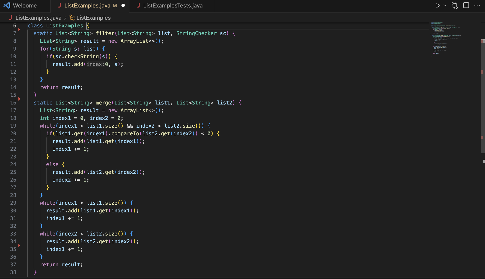
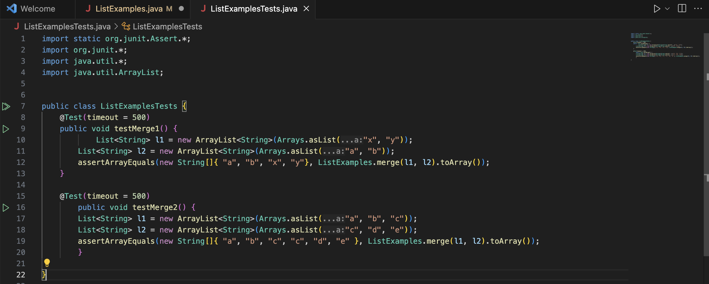
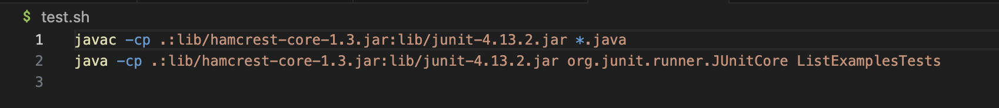
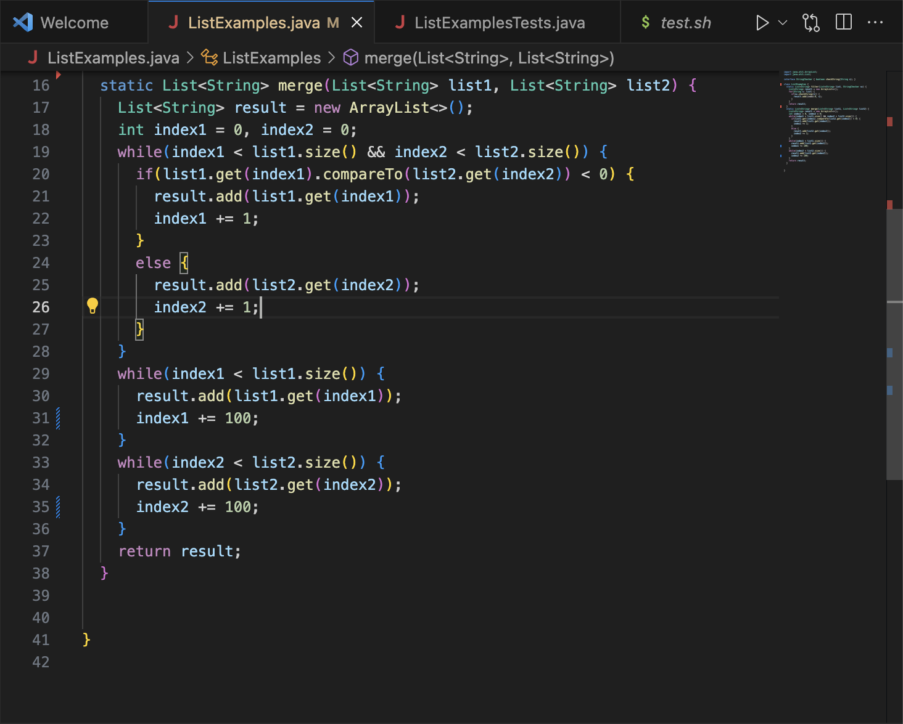
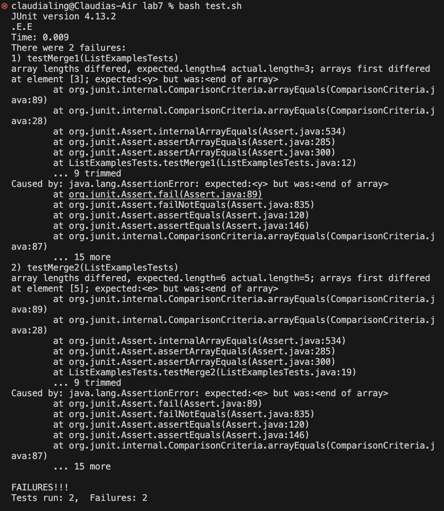

## Part 1
1. Content of student's post
 
- The symptom is that there is a logic error in the code since the failure-inducing output shows that there is failures in such code where the error is shown when testing in ListExamplesTest.java which uses the logic and methods in ListExamples.java.

2. Response from TA
- Does the logic of the each line of the code make sense? Check syntax of each line of code that may be producing a failure.

3. Terminal Output
 
- In ListExamplesTests.java, one of the test failed due to the bug in the code where there was a logic error in one of the methods in ListExamples.java.

4a. File and Directory Structure
 

4b. Contents of each file before fixing the bug
 
 

4c. Command Lines ran to trigger bug
~~~
bash test.sh
~~~
 

4d. Description of what to edit to fix the bug
To fix the bug, there is a syntax error in the file ListExamples. Since the logic does not make sense to increment the count of index1 when comparing with list 2, we want to increment index2 when comparing list 2 so the fix in the bug is to change index1 to index2 which fixes the error.

5. Interesting Error

This error is interesting as there is an unexpected error where there is a error in the array length bounds whcih produces a failure inducing output of the merge function in which the index1 and index2 have array out of bounds errors.

## Part 2
Something interesting I learned in the second half of this lab course is learning how to use vim and learning how useful it can be outside using it in this course. I learned how efficient vim is by making coding faster and the shortcuts in commands that can be used.
